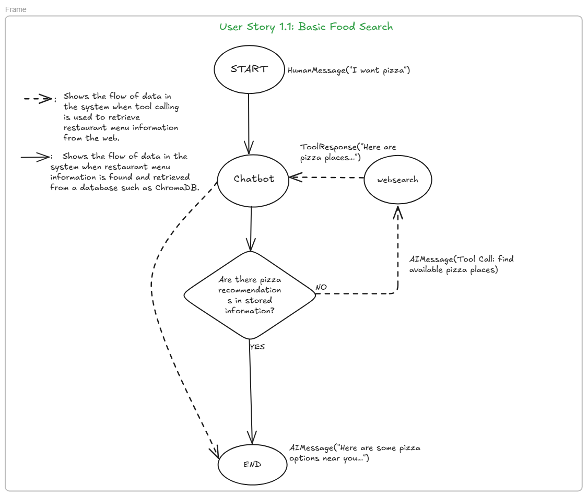
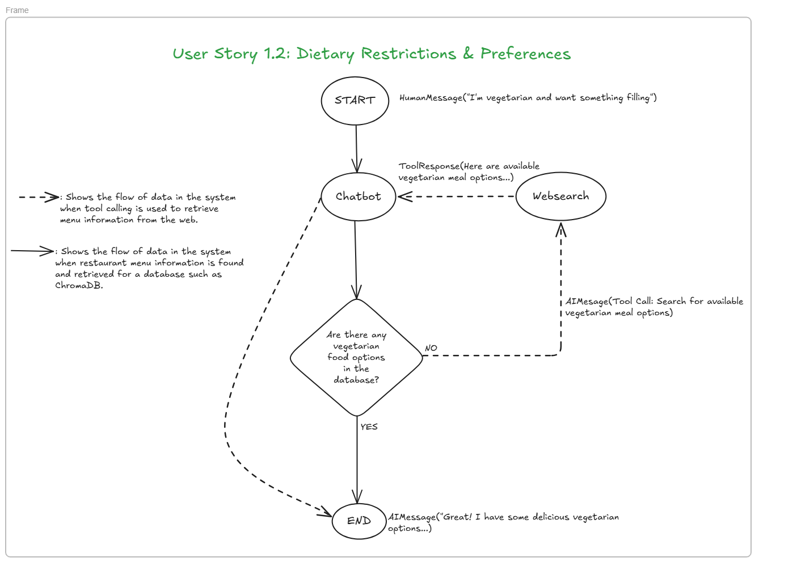
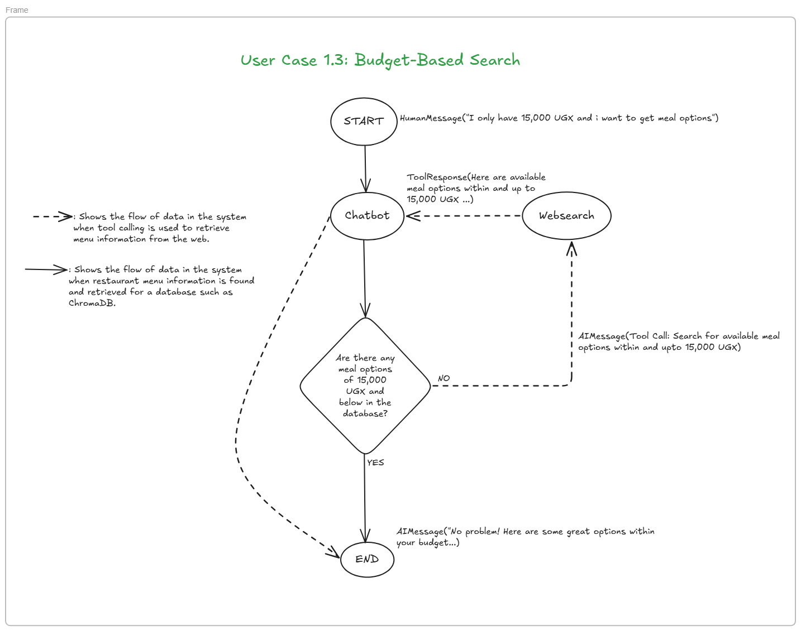
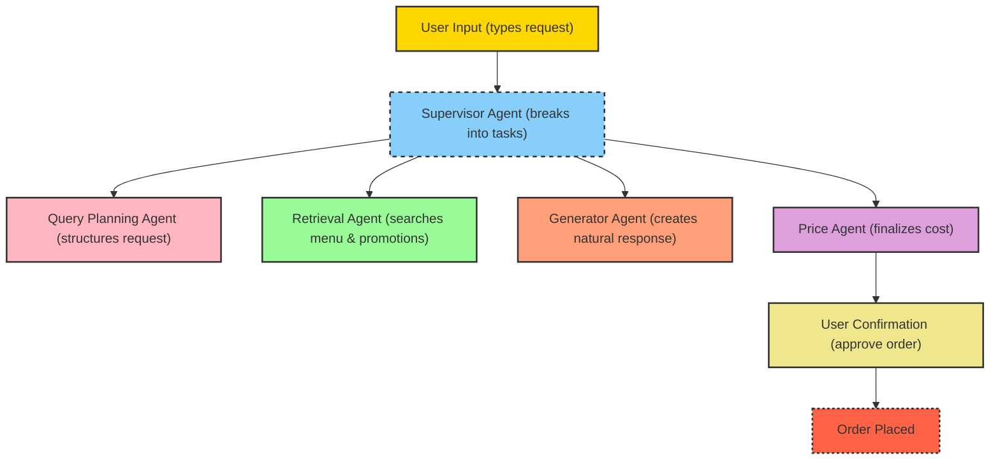

# Detailed Project Explanation: Conversational Food Ordering Assistant

## 1. Purpose of the Project
The goal is to simplify food ordering by replacing endless menu scrolling and clunky filters with a natural, conversational assistant powered by LLMs. Instead of navigating menus manually, users will chat with the system to find, customize, and order food.

---
## 2. User Cases

---
## 3. High-Level Architecture
The assistant operates as a multi-agent Retrieval-Augmented Generation (RAG) system. This means instead of one giant model doing everything, multiple specialized agents collaborate, each handling a specific task.

**Supervisor Agent** – Think of this as the “manager.” It breaks user input into smaller tasks and assigns them to the right agents.

**Query Planning Agent** – Refines what the user said into a precise, structured query.

**Retrieval Agent** – Looks up menu items, restaurant deals, and promotions from a database or API (e.g., Glovo).

**Generator Agent** – Creates a clear, friendly, context-aware response for the user.

**Price Agent** – Ensures the user knows the exact cost, including discounts or delivery fees.

---

## 4. Detailed Agent Breakdown

### 4.1 Supervisor Agent
The supervisor oversees the entire conversation flow by identifying what the user wants and assigning the right tasks to other agents. It exists to prevent overlaps or missed steps, ensuring smooth orchestration throughout the interaction. For example, when a user says, “I’m craving spicy noodles under 20,000 UGX,” the supervisor detects the key details—(a) food type = noodles, (b) taste = spicy, and (c) budget = 20,000 UGX—and then passes this structured request to the Query Planning Agent.

### 4.2 Query Planning Agent
The Query Planning Agent takes the user’s raw request and translates it into a structured query that the Retrieval Agent can understand. It exists because user requests are often vague, and this agent removes ambiguity by converting natural language into clear, machine-readable instructions. For example, if the input is “Spicy noodles under 20,000 UGX”, the agent outputs a structured query such as { "dish": "noodles", "spice_level": "spicy", "max_price": 20000 }.

### 4.3 Retrieval Agent
The Retrieval Agent searches the menu database or API for items that match the structured query and retrieves details such as the dish name, price, restaurant, and available promotions. It exists because LLMs cannot store all menus, so this agent provides real-time access to updated menus and deals. For example, given the query { "dish": "noodles", "spice_level": "spicy", "max_price": 20000 }, the Retrieval Agent might return a result like “Spicy Chicken Noodles – 18,500 UGX at Wok & Grill (10% off today).”

### 4.4 Generator Agent
The Generator Agent converts the retrieved results into natural, conversational text while maintaining a friendly tone and context awareness. It exists because raw data is not user-friendly, and this agent ensures the interaction feels like a real assistant rather than just a database query. For example, instead of displaying JSON results, it would respond with something like: “I found Spicy Chicken Noodles for 18,500 UGX at Wok & Grill. They’re also giving a 10% discount today. Want me to add this to your order?”

### 3.5 Price Agent
The Pricing Agent ensures that the final price is clear and accurate by calculating totals that include the dish price, delivery fees, discounts, and promotions. It exists because users want to know the exact total cost before confirming an order, making transparency essential. For example, if the dish price is 18,500 UGX, the delivery fee is 2,000 UGX, and a discount of -1,850 UGX is applied, the agent presents the Final Price = 18,650 UGX.

## 5. Data Flow
Agents' step by step interaction:

1. **User**: Types what they want.
2. **Supervisor Agent**: Breaks request into tasks.  
3. **Query Planning Agent**: Structures the request.  
4. **Retrieval Agent**: Searches menu and promotions.  
5. **Generator Agent**: Creates a natural response.  
6. **Price Agent**: Finalizes the cost.  
7. **User Confirmation**: User approves, and the order is placed.  

---

## 6. Example Walkthrough
User: *“Get me a vegetarian pizza under 25,000 UGX.”*

- **Supervisor Agent**: Recognizes dish = pizza, dietary preference = vegetarian, budget = 25,000 UGX.  
- **Query Planning Agent**: Converts request → `{ "dish": "pizza", "diet": "vegetarian", "max_price": 25000 }`  
- **Retrieval Agent**: Finds *“Vegetarian Delight Pizza – 23,000 UGX at Pizza Hub”*.  
- **Generator Agent**: Responds *“Pizza Hub has a Vegetarian Delight Pizza for 23,000 UGX. Should I add it to your cart?”*  
- **Price Agent**: Confirms final cost = 23,000 UGX + 2,000 UGX delivery = 25,000 UGX.  
- **User**: Says yes → order confirmed.  

---

## 7. Why Multi-Agent Design?
Instead of one giant LLM doing everything, dividing tasks amongst agents offers:
- **Specialization** → Each agent does one job well.  
- **Flexibility** → Easier to swap or upgrade parts (e.g., new retrieval API).  
- **Transparency** → Easier to debug when errors occur.

---

## 8. Handling Menu Updates

### The Challenge
Restaurant menus are not static. Items can:
- Go out of stock
- Get price changes 
- Receive new promotions  

If our system only relies on a cached database, it risks working with outdated data (e.g., recommending a dish that no longer exists).

### The Solution
Below are the different strategies that could be implemented to solve this problem:

1. **API-First Retrieval**  
   - Whenever possible, menu queries are made directly against Glovo’s API (or restaurant APIs).  
   - This ensures the Retrieval Agent always sees the latest prices and availability.  

2. **Scheduled Sync**  
   - Our menu database is refreshed at fixed intervals (e.g., every 30 minutes).  
   - This reduces API costs while keeping data mostly up to date.  

3. **Hybrid Approach with Validation Agent**  
   - If an item is retrieved from the database, the system uses a Validation Agent to confirm availability via the live API before showing it to the user.  
   - If the item is unavailable, the assistant suggests alternatives.  

### Example
- User asks for *“Spicy Beef Burger”*.  
- Retrieval Agent finds it in the cached DB.  
- Validation Agent checks API → Item is out of stock.  
- Assistant replies:  
  *“The Spicy Beef Burger is currently unavailable, but I found a Cheesy Beef Burger instead. Want to try that?”*

### Where **LangGraph** Helps
- LangGraph coordinates the flow between Retrieval and Validation Agents.  
- It ensures queries don’t “skip” the freshness check.  
- If the Validation Agent returns `unavailable`, LangGraph routes the workflow to alternative item retrieval before responding to the user.  

---

## 9. Tech Stack

**Backend**: Python (FastAPI for APIs)  
**LLM Orchestration**:  
LangGraph → for multi-agent coordination and stateful workflows  
LangChain → for retrieval-augmented queries and tool use  
**Database Layer**: Chromadb 
**API Integration**: Glovo API (primary source of truth for menus, availability, promotions)  
**Frontend**: Streamlit

---

## 10. Summary
This project transforms menu navigation into a natural, conversational experience. By using a multi-agent approach, the system becomes fast, eliminating the need for endless scrolling; smart, with the ability to understand user context and preferences; transparent, by clearly displaying prices and promotions; and fresh, ensuring menus are always up to date.
