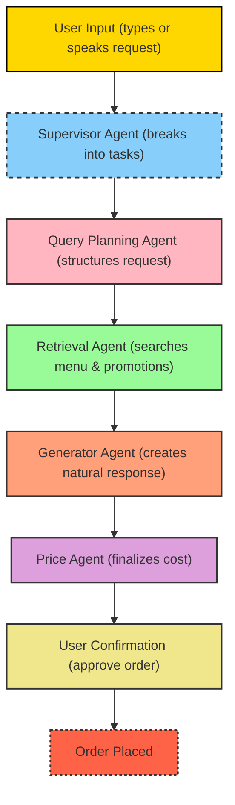

# Detailed Project Explanation: Conversational Food Ordering Assistant

This document explains **in detail** how the food ordering project will work. It breaks down each component of the multi-agent system, what it does, why it exists, and provides real-world examples.

---

## 1. Purpose of the Project
The goal is to **simplify food ordering** by replacing endless menu scrolling and clunky filters with a natural, conversational assistant powered by LLMs. Instead of navigating menus manually, users will **chat** with the system to find, customize, and order food.

---

## 2. High-Level Architecture
The assistant operates as a **multi-agent Retrieval-Augmented Generation (RAG) system**. This means instead of one giant model doing everything, multiple specialized agents collaborate, each handling a specific task.

- **Supervisor Agent** – Think of this as the “manager.” It breaks user input into smaller tasks and assigns them to the right agents.
- **Query Planning Agent** – Refines what the user said into a precise, structured query.
- **Retrieval Agent** – Looks up menu items, restaurant deals, and promotions from a database or API (e.g., Glovo).
- **Generator Agent** – Creates a clear, friendly, context-aware response for the user.
- **Price Agent** – Ensures the user knows the exact cost, including discounts or delivery fees.

---

## 3. Detailed Agent Breakdown

### 3.1 Supervisor Agent
**What it does:**  
- Oversees the entire conversation flow.  
- Identifies what the user wants and assigns the right tasks to other agents.  

**Why it exists:**  
Without a supervisor, agents could overlap or miss steps. The supervisor ensures smooth orchestration.  

**Example:**  
User says: *“I’m craving spicy noodles under 20,000 UGX.”*  
- Supervisor detects: (a) food type = noodles, (b) taste = spicy, (c) budget = 20,000 UGX.  
- It then sends this to the Query Planning Agent.

---

### 3.2 Query Planning Agent
**What it does:**  
- Takes the user’s raw request and translates it into a structured query that the Retrieval Agent can understand.  

**Why it exists:**  
User requests are often vague. This agent removes ambiguity.  

**Example:**  
Input: *“Spicy noodles under 20,000 UGX”*  
Output: `{ "dish": "noodles", "spice_level": "spicy", "max_price": 20000 }`

---

### 3.3 Retrieval Agent
**What it does:**  
- Searches the menu database or API for items that match the structured query.  
- Retrieves details such as dish name, price, restaurant, and promotions.  

**Why it exists:**  
LLMs can’t store all menus. The Retrieval Agent provides **real-time access** to updated menus and deals.  

**Example:**  
Query: `{ "dish": "noodles", "spice_level": "spicy", "max_price": 20000 }`  
Result: *“Spicy Chicken Noodles – 18,500 UGX at Wok & Grill (10% off today)”*

---

### 3.4 Generator Agent
**What it does:**  
- Converts the retrieved results into natural, conversational text.  
- Maintains friendly tone and context awareness.  

**Why it exists:**  
Raw data is not user-friendly. The Generator Agent makes it feel like a real assistant.  

**Example:**  
Instead of showing JSON results, it responds:  
*“I found Spicy Chicken Noodles for 18,500 UGX at Wok & Grill. They’re also giving a 10% discount today. Want me to add this to your order?”*

---

### 3.5 Price Agent
**What it does:**  
- Ensures the final price is clear and accurate.  
- Calculates totals including delivery fee, discounts, or promotions.  

**Why it exists:**  
Users care about **total cost** before confirming. This agent ensures transparency.  

**Example:**  
Dish price: 18,500 UGX  
Delivery: 2,000 UGX  
Discount: -1,850 UGX  
**Final Price = 18,650 UGX**

---

## 4. Data Flow
Here’s how the agents interact step by step:

1. **User: Types what they want.
2. **Supervisor Agent**: Breaks request into tasks.  
3. **Query Planning Agent**: Structures the request.  
4. **Retrieval Agent**: Searches menu and promotions.  
5. **Generator Agent**: Creates a natural response.  
6. **Price Agent**: Finalizes the cost.  
7. **User Confirmation**: User approves, and the order is placed.  

---

## 5. Real-World Example Walkthrough
User: *“Get me a vegetarian pizza under 25,000 UGX.”*

- **Supervisor Agent**: Recognizes dish = pizza, dietary preference = vegetarian, budget = 25,000 UGX.  
- **Query Planning Agent**: Converts request → `{ "dish": "pizza", "diet": "vegetarian", "max_price": 25000 }`  
- **Retrieval Agent**: Finds *“Vegetarian Delight Pizza – 23,000 UGX at Pizza Hub”*.  
- **Generator Agent**: Responds *“Pizza Hub has a Vegetarian Delight Pizza for 23,000 UGX. Should I add it to your cart?”*  
- **Price Agent**: Confirms final cost = 23,000 UGX + 2,000 UGX delivery = 25,000 UGX.  
- **User**: Says yes → order confirmed.  

---

## 6. Why Multi-Agent Design?
Instead of one giant LLM doing everything, splitting into agents offers:
- **Specialization** → Each agent does one job well.  
- **Flexibility** → Easier to swap or upgrade parts (e.g., new retrieval API).  
- **Transparency** → Easier to debug when errors occur.

---

## 7. Handling Menu Updates (Freshness Problem)

### The Challenge
Restaurant menus are not static. Items can:
- Go **out of stock**  
- Get **price changes**  
- Receive **new promotions**  

If our system only relies on a cached database, it risks working with **outdated data** (e.g., recommending a dish that no longer exists).

### The Solution
To prevent this, we implement a **data freshness strategy**:

Below are the different strategies that could be implemented to solve this problem:

1. **API-First Retrieval**  
   - Whenever possible, menu queries are made **directly against Glovo’s API** (or restaurant APIs).  
   - This ensures the Retrieval Agent always sees the latest prices and availability.  

2. **Scheduled Sync**  
   - Our menu database is refreshed at fixed intervals (e.g., every 30 minutes).  
   - This reduces API costs while keeping data mostly up to date.  

3. **Hybrid Approach with Validation Agent**  
   - If an item is retrieved from the database, the system uses a **Validation Agent** to confirm availability via the live API before showing it to the user.  
   - If the item is unavailable, the assistant suggests alternatives.  

### Example
- User asks for *“Spicy Beef Burger”*.  
- Retrieval Agent finds it in the cached DB.  
- Validation Agent checks API → Item is out of stock.  
- Assistant replies:  
  *“The Spicy Beef Burger is currently unavailable, but I found a Cheesy Beef Burger instead. Want to try that?”*

### Where **LangGraph** Helps
- LangGraph coordinates the **flow between Retrieval and Validation Agents**.  
- It ensures queries don’t “skip” the freshness check.  
- If the Validation Agent returns `unavailable`, LangGraph routes the workflow to **alternative item retrieval** before responding to the user.  

---

## 8. Tech Stack

- **Backend**: Python (FastAPI for APIs)  
- **LLM Orchestration**:  
  - **LangGraph** → for multi-agent coordination and stateful workflows  
  - **LangChain** → for retrieval-augmented queries and tool use  
- **Database Layer**: Chromadb 
- **API Integration**: Glovo API (primary source of truth for menus, availability, promotions)  
- **Frontend**: Streamlit

---

## 9. Summary
This project turns **menu navigation into natural conversation**.  
The multi-agent approach ensures the system is:  
- **Fast** (no endless scrolling)  
- **Smart** (understands context/preferences)  
- **Transparent** (clear prices and promotions)  
- **Fresh** (menus always up to date) 
